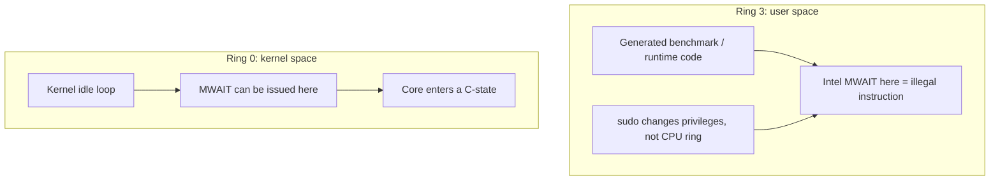
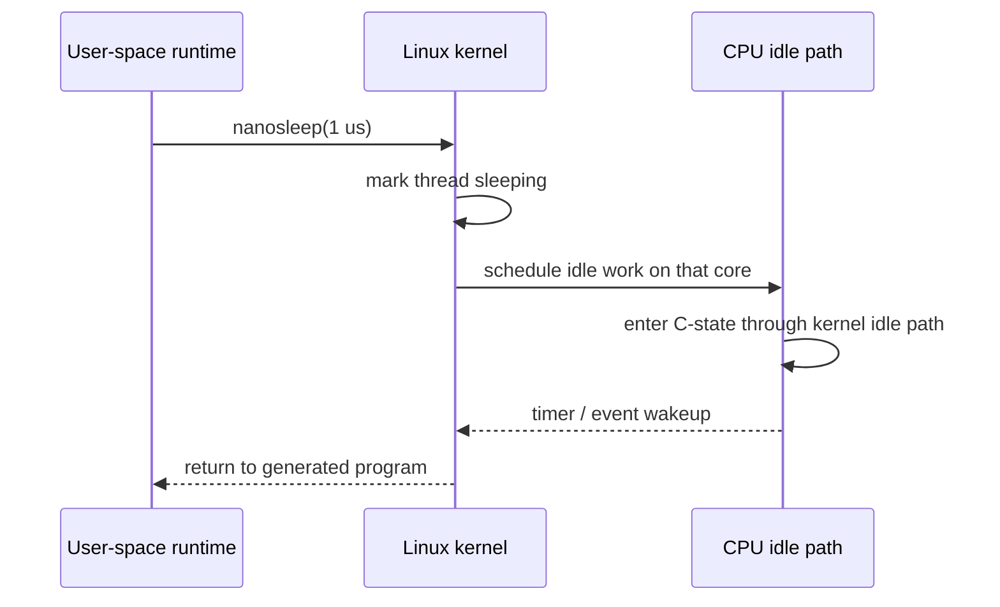
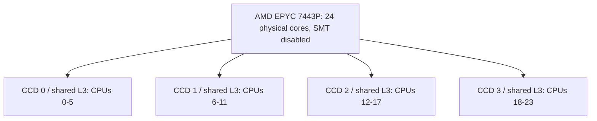
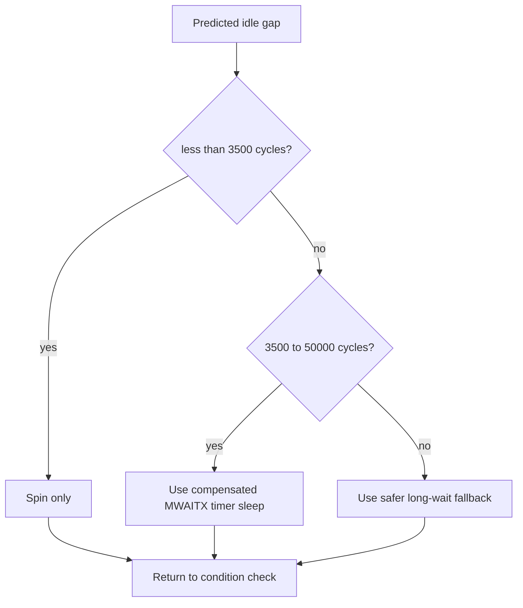
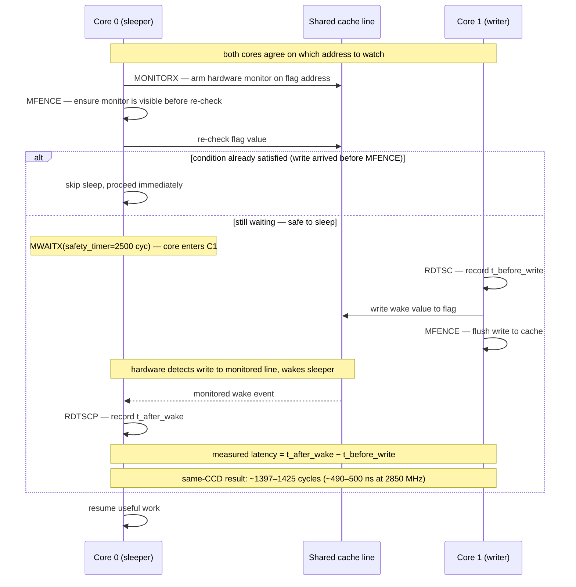
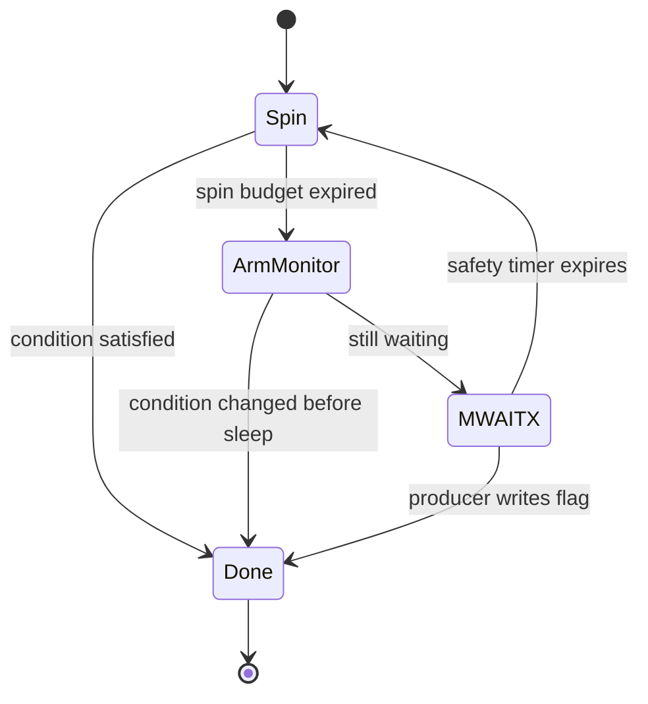

## Overview

This document describes the clock gating implementation I did for the OSCAR parallelizing compiler (Owned by Kasahara Lab) on Intel Xeon Gold 6326 CPUs, including why my original approach failed and the working solution with nanosleep().

---

## The Problem We Were Trying to Solve

During parallel execution, some CPU cores wait idle while others finish their work (synchronization barriers). These idle cores waste power spinning in busy-wait loops:

```c
// Original OSCAR-generated busy-wait
while (sync_flag != expected) {
    #pragma omp flush
}
```

On a multi-core run, cores rarely finish their assigned work at exactly the same time. The cores that finish early have to spin at full power waiting for the slowest one before the program can proceed:

```mermaid
gantt
    title Parallel execution: uneven work creates spinning gaps at the barrier
    dateFormat  X
    axisFormat  %Ss

    section Core 0
    Parallel work              : done, 0, 5
    Spinning at full power     : crit, 5, 10
    Next phase                 : done, 10, 15

    section Core 1  (slowest)
    Parallel work              : done, 0, 10
    Next phase                 : done, 10, 15

    section Core 2
    Parallel work              : done, 0, 3
    Spinning at full power     : crit, 3, 10
    Next phase                 : done, 10, 15

    section Core 3
    Parallel work              : done, 0, 7
    Spinning at full power     : crit, 7, 10
    Next phase                 : done, 10, 15
```



Cores 0, 2, and 3 are fully active and drawing power but doing no useful work during the red regions. The goal is to replace those spinning gaps with low-power sleep.

**Goal**: Put idle cores into low-power sleep states (C-states) during these waits.

---

## Original Approach: MWAIT (Failed)

### What I Tried

Intel provides `MONITOR`/`MWAIT` instructions specifically designed for power-efficient waiting:

```c
// Monitor an address for changes
__asm__ volatile ("monitor" : : "a"(addr), "c"(0), "d"(0));

// Wait until the monitored address changes (enters C-state)
__asm__ volatile ("mwait" : : "a"(hint), "c"(0));
```

### Why It Failed: "Illegal Instruction"

```
$ ./ep.A.8.clockgate
Illegal instruction (core dumped)
```

### Technical Reason: CPU Privilege Levels (Ring 0 vs Ring 3)



**An insight**: `sudo` gives you root *privileges* (admin rights), but you're still in Ring 3 (user space). MWAIT is a **privileged instruction** that can only execute in Ring 0 (kernel space).

On older Linux kernels (pre-2.6), MWAIT sometimes worked from user space. Modern kernels block this for security reasons.

---

## Governor Confusion

### What is a CPU Governor?

The governor controls how the kernel manages CPU frequency:

| Governor | Frequency Control | Turbo Boost | Use Case |
|----------|------------------|-------------|----------|
| `performance` | Kernel manages, max freq | Yes (3.5 GHz) | Best performance |
| `userspace` | Manual via sysfs | No (max 2.9 GHz) | Fine-grained control |
| `powersave` | Kernel manages, min freq | No | Battery saving |

### The Problem We Hit

Our original script used `userspace` governor for frequency changes:

```bash
sudo cpupower frequency-set -g userspace
sudo cpupower frequency-set -f 2900000  # Set to 2.9 GHz
```

**Result**: Baseline ran 3x slower (~69s instead of ~21s) because:
- `userspace` governor caps frequency at 2.9 GHz
- No turbo boost (which goes up to 3.5 GHz)

### Why We Thought We Needed Userspace Governor

The OSCAR `fvcontrol` pragma supports frequency scaling:

```c
#pragma oscar fvcontrol(pe, (FV_LOGIC, 50))  // Set CPU to 50% frequency
```

This requires writing to sysfs files:
```
/sys/devices/system/cpu/cpu0/cpufreq/scaling_setspeed
```

Which only works with `userspace` governor.

**But clock gating (rate -1) doesn't need frequency control** - it needs C-states, which work with ANY governor.

---

## New Approach: nanosleep() (Working so far...)

### How It Works

Instead of using MWAIT directly, we call `nanosleep()`:

```c
// Our code (Ring 3 - user space)
nanosleep(&ts, NULL);  // Sleep for 1 microsecond

// Internally, the kernel (Ring 0) does:
// 1. Marks thread as sleeping
// 2. Runs idle loop on that CPU
// 3. Idle loop uses MWAIT to enter C-state
// 4. CPU enters C1/C6 = power savings!
```



### Why nanosleep Works with Any Governor

- nanosleep is a **syscall** - it works regardless of governor
- The kernel manages C-states internally during idle
- We don't need manual frequency control for clock gating

### Implementation Details

OSCAR uses `-nostdinc` flag (no standard includes), so we can't use `<time.h>`. Solution: inline syscall assembly.

```c
static inline void oscar_nanosleep_syscall(long nsec) {
    long ts[2] = {0, nsec};  // struct timespec {sec, nsec}

    __asm__ volatile (
        "syscall"
        : /* no outputs */
        : "a"(35),      // syscall number: nanosleep = 35 on x86_64
          "D"(ts),      // rdi = &timespec
          "S"((long)0)  // rsi = NULL
        : "rcx", "r11", "memory"
    );
}
```

---

## C-States Explained

When a CPU core has nothing to do, it can enter progressively deeper sleep states:

| C-State | Name | Power Reduction | Wake-up Latency | What Happens |
|---------|------|-----------------|-----------------|--------------|
| C0 | Active | 0% | 0 | Running code |
| C1 | Halt | ~50% | ~1 us | Clock stopped |
| C1E | Enhanced Halt | ~60% | ~10 us | Clock + voltage reduced |
| C6 | Deep Sleep | ~90% | ~100 us | Most circuits off |

### How to Verify Clock Gating Works

Check C-state residency before and after running:

```bash
# Read C-state times (in microseconds)
cat /sys/devices/system/cpu/cpu0/cpuidle/state*/name
cat /sys/devices/system/cpu/cpu0/cpuidle/state*/time
```

**Expected results**:
- Baseline (no clock gating): Minimal C-state increase during test
- Clock gated version: Significant C1/C6 increase = cores actually sleeping

---

## Summary: What Changed

| Aspect | Original (Broken) | New (Working) |
|--------|-------------------|---------------|
| Clock gating method | MWAIT instruction | nanosleep() syscall |
| Why it failed/works | Ring 3 can't execute MWAIT | Kernel handles MWAIT internally |
| Governor | `userspace` (no turbo) | `performance` (turbo enabled) |
| Frequency scaling | Manual sysfs writes | Not used (clock gating only) |
| Baseline speed | ~69s (slow, no turbo) | ~21s (fast, turbo enabled) |

---

## Files Modified

1. **`oscar_clockgate_runtime.h`** - Complete rewrite
   - Removed MWAIT-based code
   - Added nanosleep via inline syscall
   - Works with `-nostdinc` flag

2. **`Makefile.clockgate`** - Updated flags
   - Removed: `MWAIT_ENABLED`, `MWAIT_HINT`
   - Added: `SLEEP_NS`, `USE_YIELD`

3. **`full_eval_clockgate.sh`** - Updated evaluation script
   - Changed to `performance` governor
   - Added C-state monitoring
   - Removed MWAIT references

---

## Usage

```bash
# Run evaluation (example: Class A, 8 threads, 4 iterations, EP benchmark)
./full_eval_clockgate.sh A 8 4 EP

# Check results
cat results_clockgate_*.txt
```

---

## Configuration Options

In `oscar_clockgate_runtime.h`:

```c
#define OSCAR_SLEEP_NS 1000        // Sleep duration (1 us default)
#define OSCAR_USE_YIELD 0          // Use sched_yield instead of nanosleep
#define OSCAR_CLOCKGATE_DEBUG 0    // Enable debug output
#define OSCAR_NUM_CPUS 16          // Number of CPUs
```

---

## References

- Intel 64 and IA-32 Architectures Software Developer's Manual (MWAIT)
- Linux kernel CPU idle documentation
- ACPI C-states specification

---

## 2026 Update: Pivot to AMD MWAITX / MONITORX

The earlier sections are still useful because they show the path I took: Intel
`MWAIT` from userspace failed, so I moved to a `nanosleep()` based fallback. The
research direction has since pivoted again after testing on an AMD server where
`MWAITX` and `MONITORX` are available from userspace.

This section is intentionally public-safe. It records the hardware-level power
reduction approach, the CPU profile, and the latency numbers I measured. It does
not document private compiler internals, unpublished benchmark results, or any
confidential lab-specific implementation details.

### Research Path So Far


### Current Test Platform

| Item | Value |
|------|-------|
| CPU | AMD EPYC 7443P |
| Microarchitecture | Zen 3 / Milan |
| Physical cores | 24 |
| SMT | Disabled |
| CCD layout | 4 CCDs x 6 cores |
| L2 cache | 512 KB per core |
| L3 cache | 32 MB per CCD |
| Base clock | 2100 MHz |
| Boost / TSC reference | about 2850 MHz |

Important correction: for cycle-to-time conversion on this machine, I use the
measured TSC reference of about **2850 MHz**, not the 2100 MHz base clock.



### Why AMD Changed the Direction

Intel `MWAIT` was not usable directly from userspace in my earlier environment.
On this AMD platform, the related AMD instructions are the useful pair:

- `MONITORX`: arm a monitored memory address
- `MWAITX`: put the core into a low-power wait until either the address changes,
  a timer expires, or an interrupt arrives

That changes the design from "ask the kernel to sleep this thread" to "let the
runtime put an idle worker core into C1 directly." For short idle gaps, this is
much closer to what I originally wanted: avoid spinning at full power while also
avoiding syscall and scheduler overhead.

### Updated MWAITX Timer-Wake Findings

I reran the timer-wake measurement and updated the constants from the older
rough values. The new shape is:

| Quantity | Current value | Meaning |
|----------|---------------|---------|
| Practical floor | about 800 cycles | Requests below this are too short to be useful |
| Timer overhead | about 1600 cycles | Typical excess over the requested sleep in the stable region |
| Minimum reliable sleep | about 3500 cycles | First useful C1 timer request size |
| Useful measured range | about 3500 to 50000 cycles | Region where userspace timer waits stayed predictable |

At 2850 MHz, 3500 cycles is about 1.23 us. This means the runtime should not try
to sleep for every tiny idle gap. Very short waits are still better handled by a
brief spin.

The practical rule I am using now:



### Updated MONITORX Wake Findings

The newer same-CCD wake tests use one core sleeping on a monitored flag and a
neighboring core writing that flag. The same-CCD result is consistently around:

| Measurement | Value |
|-------------|-------|
| Median wake latency | about 1397 cycles |
| p95 / p99 wake latency | about 1425 cycles |
| Time at 2850 MHz | about 490 to 500 ns |

This was the important result for the current direction. A monitored wake within
the same CCD is fast enough that a hybrid wait can spin briefly, then enter
`MWAITX`, without paying a huge wakeup penalty.



Cross-CCD wake behavior still needs to be treated more cautiously. I have older
numbers for that case, but the clean rerun documented here refreshed the
same-CCD case first.

### Current Public Runtime Idea

The implementation idea is now a hybrid wait:

1. Spin briefly for very short waits.
2. If the condition is still not satisfied, arm `MONITORX` on the shared flag.
3. Fence and re-check the condition so a write is not missed between arming and
   sleeping.
4. Enter `MWAITX` with a short safety timer.
5. Wake either when the producer writes the flag or when the safety timer expires.

In simplified form:

```c
while (*flag != expected) {
    short_spin();

    monitorx(flag);
    memory_fence();

    if (*flag != expected) {
        mwaitx_with_timer(SAFETY_TIMER_CYCLES);
    }
}
```

This is different from the older `nanosleep()` approach. `nanosleep()` can still
be useful as a portable fallback, but the AMD path is now focused on direct C1
clock gating through `MWAITX`.



### Current Constants I Am Using

| Constant | Value |
|----------|-------|
| TSC reference | 2850 MHz |
| Spin budget | about 1000 cycles |
| MWAITX overhead compensation | about 1600 cycles |
| MWAITX practical floor | about 800 cycles |
| Minimum MWAITX sleep request | about 3500 cycles |
| Maximum short userspace sleep request | about 50000 cycles |
| Monitor-wait safety timer | about 2500 cycles |

These are measurement-derived constants for this AMD EPYC 7443P system. They
should not be treated as universal AMD values.

### What This Means for Power Reduction

The core idea has become clearer:

- Frequency scaling changes how fast an active core runs.
- Clock gating changes whether an idle core is switching at all.
- For short synchronization gaps, clock gating is the more relevant mechanism.

The current goal is not to force every idle interval into sleep. The goal is to
identify waits that are long enough to make C1 entry worthwhile, then replace
full-speed busy-waiting with a measured, bounded low-power wait.

### What I Learned From the Pivot

The older Intel result was not a dead end; it clarified the boundary between
privileged `MWAIT`, OS-mediated sleep, and hardware-supported userspace waiting.
The AMD result then reopened the original idea in a cleaner way: direct
userspace clock gating is possible on this machine, but only if the runtime is
honest about latency floors, wakeup overhead, and topology.

This is why the diary keeps both approaches. The current AMD direction makes
more sense because of the measurements, not because the earlier nanosleep path
was meaningless.

